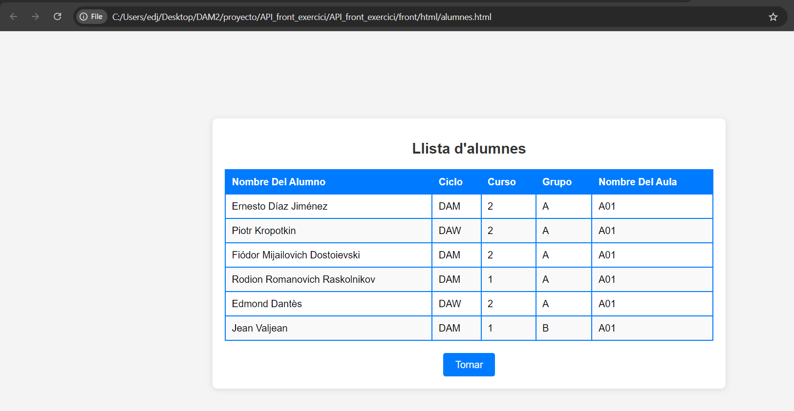
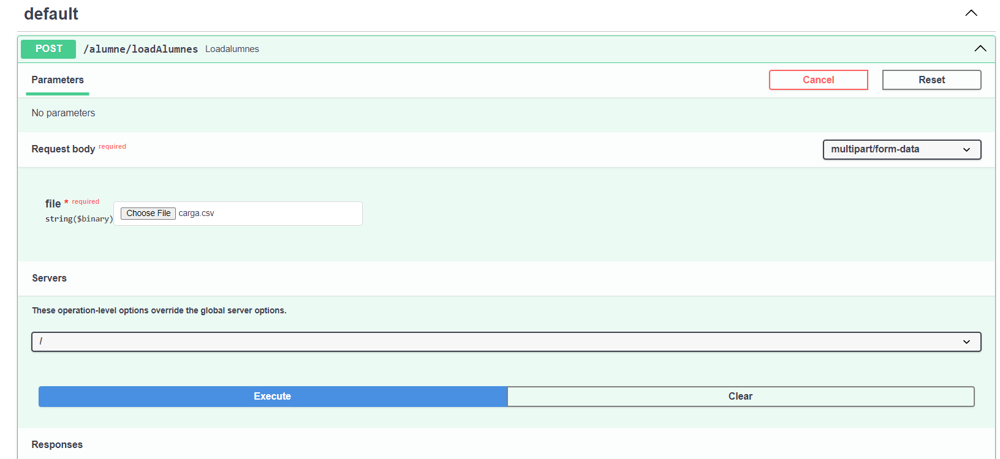
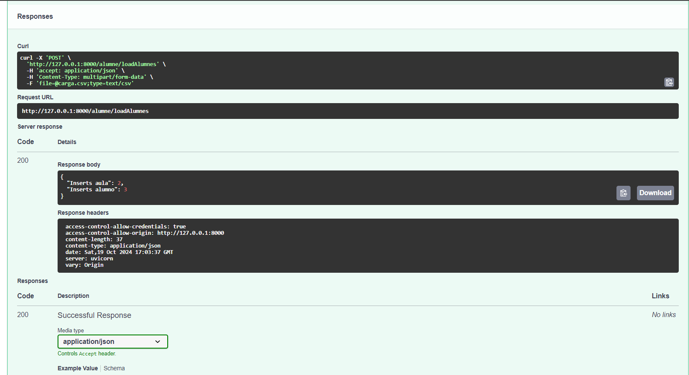

<h3><u>Apartat 1: Crida de l’API des de la web</u><h3>

<h3><u>Apartat 2: Consultes avançades</u><h3>
<ul>
    <li>?orderby= (str) 
        
        
    </li>
    <li>?contain=(str)
        
    </li>
        <li>?skip= (int)&limit=(int)
        
    </li>
</ul>
<h3><u>Apartat 3: Càrrega massiva d’alumnes</u><h3>
    <ul>
        <li>Documento de la carga csv
            
        </li>
        <li>Base de datos antes de la carga
            
             
        </li>
        <li>Carga de datos
            
            
        </li>
        <li>Carga de datos con el mismo fichero
             
        </li>
        <li>Base de datos después de la carga
            
             
        </li>
    </ul>

   
</ol>